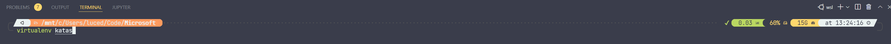
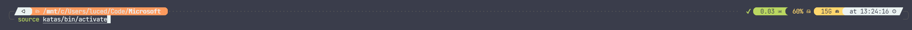
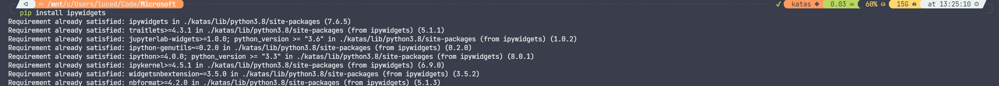
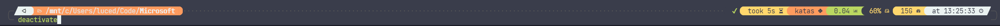

Como evidencia a la Solución de la Kata 2. 

* Se tiene que crear el entorno con la herramienta 'virtualenv' seguido del nombre 'katas'

  
* A continuación activar el entorno virtual con el comando 'source' seguido del acceso a

  
* En caso de no haber tenido ninguna falla, el entorno se mostrará activado de la siguienet manera 😊

* Podremos instalar todas la librerias de nuestra preferencia o versiones de python sin necesidad de afectar nuestro entorno local

* En caso de querer desactivar, existe el comando deactivate (únicamente válido dentro del entorno) este automáticamente saldrá del entorno

